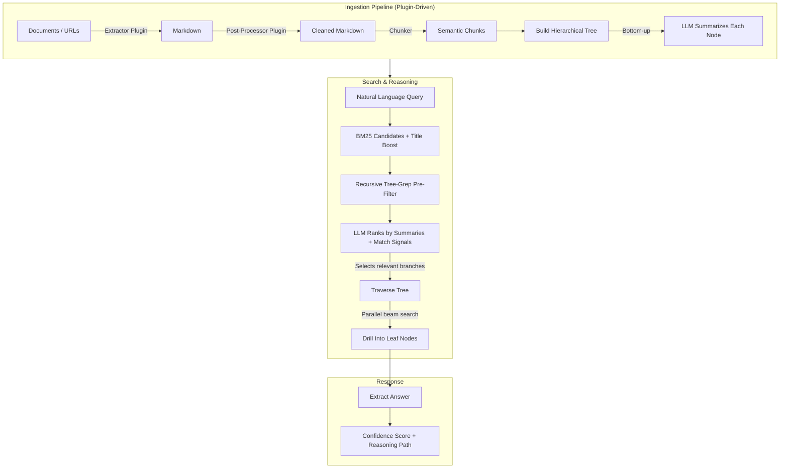

<br>

<p align="center">
    
</p>

<h3 align="center">
    <strong>AI-Native Document Intelligence</strong>
</h3>

<p align="center">
    The database that understands your documents.<br/>
    Built for AI agents that need to reason, not just retrieve.
</p>

<br>

<p align="center">
    <a href="https://github.com/reasondb/reasondb"></a>
    &nbsp;
    <a href="https://github.com/reasondb/reasondb"></a>
    &nbsp;
    <a href="https://github.com/reasondb/reasondb/actions"></a>
    &nbsp;
    <a href="https://github.com/reasondb/reasondb/blob/main/LICENSE"></a>
</p>

<p align="center">
    <a href="https://hub.docker.com/r/ajainvivek/reasondb"></a>
    &nbsp;
    <a href="https://github.com/reasondb/reasondb"></a>
    &nbsp;
    <a href="https://github.com/reasondb/reasondb"></a>
</p>

<p align="center">
    <a href="https://reason-db.devdoc.sh">Docs</a>
    &nbsp;&bull;&nbsp;
    <a href="https://reason-db.devdoc.sh/quickstart">Quick Start</a>
    &nbsp;&bull;&nbsp;
    <a href="https://reason-db.devdoc.sh/api-reference/introduction">API Reference</a>
    &nbsp;&bull;&nbsp;
    <a href="https://discord.gg/reasondb">Discord</a>
</p>

<br>

<p align="center">
    
</p>

<br>

<h2>What is ReasonDB?</h2>

ReasonDB is an AI-native document database built in Rust, designed to go beyond simple retrieval. While traditional databases and vector stores treat documents as data to be indexed, ReasonDB treats them as **knowledge to be understood** - preserving document structure, enabling LLM-guided traversal, and extracting precise answers with full context.

ReasonDB introduces **Hierarchical Reasoning Retrieval (HRR)**, a fundamentally new architecture where the LLM doesn't just consume retrieved content - it actively navigates your document structure to find exactly what it needs, like a human expert scanning summaries, drilling into relevant sections, and synthesizing answers.

> **ReasonDB is not another vector database.** It's a reasoning engine that preserves document hierarchy, enabling AI to traverse your knowledge the way a domain expert would.

**Key features of ReasonDB include:**

- **Hierarchical Reasoning Retrieval**: LLM-guided tree traversal with parallel beam search - AI navigates document structure instead of relying on similarity matching
- **RQL Query Language**: SQL-like syntax with built-in `SEARCH` (BM25) and `REASON` (LLM) clauses in a single query
- **Plugin Architecture**: Extensible extraction pipeline - PDF, Office, images, audio, and URLs out of the box via [MarkItDown](https://github.com/microsoft/markitdown)
- **Multi-Provider LLM Support**: Anthropic, OpenAI, Gemini, Cohere - switch providers without code changes
- **Production Ready**: ACID-compliant storage, API key auth, rate limiting, async parallel traversal - all in a single Rust binary

<h2>Contents</h2>

- [What is ReasonDB?](#what-is-reasondb)
- [The Problem](#the-problem)
- [How It Works](#how-it-works)
- [Quick Start](#quick-start)
- [Query with RQL](#query-with-rql)
- [Plugin Architecture](#plugin-architecture)
- [Use Cases](#use-cases)
- [Tech Stack](#tech-stack)
- [Documentation](#documentation)
- [Community](#community)
- [Contributing](#contributing)
- [License](#license)

<h2>The Problem</h2>

AI agents today are limited by their databases:

| Approach | What It Does | Why It Fails |
|----------|--------------|--------------|
| **Vector DBs** | Finds "similar" chunks | Loses structure. A contract's termination clause isn't "similar" to your question about exit terms - but it's the answer. |
| **RAG Pipelines** | Retrieves then generates | Garbage in, garbage out. Wrong chunks retrieved means wrong answers, no matter how capable the LLM. |
| **Knowledge Graphs** | Maps explicit relationships | Requires manual entity extraction. Can't handle the messy reality of real documents. |

**The result?** AI agents that hallucinate, miss critical context, or drown in irrelevant chunks.

ReasonDB solves this by letting the LLM **reason through** your documents - not just search them.

<h2>How It Works</h2>



1. **Extract** - Extractor plugins convert documents and URLs to Markdown (built-in: [MarkItDown](https://github.com/microsoft/markitdown))
2. **Chunk** - Content is split into semantic chunks with heading detection
3. **Build Tree** - Chunks are organized into a hierarchical tree structure
4. **Summarize** - LLM generates summaries for each node (bottom-up)
5. **Search** - 4-phase pipeline: BM25 candidate selection → recursive tree-grep filtering → LLM summary ranking → parallel beam-search traversal
6. **Return** - Relevant content with extracted answers, confidence scores, and the full reasoning path

<h2>Quick Start</h2>

Get from zero to intelligent document search in under 5 minutes.

#### Install from source

```bash
git clone https://github.com/reasondb/reasondb.git && cd reasondb
cargo build --release
```

#### Configure your LLM provider

```bash
reasondb config init
```

| Variable | Description | Required |
|---|---|---|
| `REASONDB_LLM_PROVIDER` | `openai`, `anthropic`, `gemini`, or `cohere` | Yes |
| `REASONDB_LLM_API_KEY` | API key for the chosen provider | Yes |
| `REASONDB_MODEL` | Override the default model for the provider | No |

#### Start the server

```bash
reasondb serve
```

Server starts at **http://localhost:4444** with Swagger UI at **http://localhost:4444/swagger-ui/**

#### Run using Docker

```bash
docker run --rm --pull always --name reasondb -p 4444:4444 \
  -e REASONDB_LLM_PROVIDER=openai \
  -e REASONDB_LLM_API_KEY=sk-... \
  ajainvivek/reasondb:latest serve
```

Or use the Makefile for local development:

```bash
make docker-up        # Build and start
make docker-up-d      # Start in background
make docker-logs      # View logs
make docker-down      # Stop containers
make docker-down-v    # Stop and remove data volume
make docker-ps        # Check health status
```

<h2>Query with RQL</h2>

ReasonDB uses **RQL** - a SQL-like query language with built-in `SEARCH` and `REASON` clauses:

```sql
-- Fast keyword search (BM25, ~50ms)
SELECT * FROM contracts SEARCH 'payment terms' LIMIT 5;

-- LLM-guided reasoning (navigates the document tree)
SELECT * FROM contracts REASON 'What are the late fees and penalties?';

-- Combine filters, search, and reasoning in one query
SELECT * FROM contracts
WHERE tags CONTAINS ANY ('nda') AND metadata.value_usd > 10000
SEARCH 'termination clause'
REASON 'What are the exit conditions?'
LIMIT 5;
```

<details>
<summary><strong>Compare: Vector DB vs ReasonDB</strong></summary>

<br>

**Vector DB Approach**
```
Query: "What are the termination conditions?"

→ Embed query as vector
→ Find 5 "similar" chunks
→ Hope one contains the answer

Result: Random paragraphs mentioning "termination"
        scattered across the document. No context.
        LLM hallucinates missing details.
```

**ReasonDB Approach**
```
Query: "What are the termination conditions?"

→ LLM reads document summary
→ Identifies "Section 8: Termination" as relevant
→ Navigates to section, reads subsection summaries
→ Drills into "8.2 Conditions for Termination"
→ Extracts complete answer with full context

Result: Precise answer citing specific clauses,
        with confidence score and reasoning path.
```

</details>

<h2>Plugin Architecture</h2>

ReasonDB uses a **plugin system** for document extraction. Plugins are external processes (Python, Node.js, Bash, or compiled binaries) that communicate via JSON over stdin/stdout.

| What ships out of the box | What you can add |
|---------------------------|------------------|
| **markitdown** - PDF, Word, Excel, PowerPoint, HTML, images (OCR), audio, YouTube, and more | Custom extractors, post-processors, chunkers, summarizers |

```bash
# List installed plugins
curl http://localhost:4444/v1/plugins

# Test a plugin
curl -X POST http://localhost:4444/v1/plugins/markitdown/test \
  -H "Content-Type: application/json" \
  -d '{"operation":"extract","params":{"source_type":"file","path":"/tmp/doc.pdf"}}'
```

Community plugins can be installed by dropping a directory into `$REASONDB_PLUGINS_DIR` (default: `./plugins`). See the [Plugin Guide](https://reason-db.devdoc.sh/guides/plugins) for details.

<h2>Use Cases</h2>

- **Legal Document Analysis** - Navigate complex contracts, find specific clauses, compare terms across agreements
- **Research & Knowledge Management** - Build searchable knowledge bases from papers, reports, and documentation
- **Customer Support Intelligence** - Transform support docs into an AI agent that finds precise answers
- **Compliance & Policy** - Query policy documents in natural language with full section references
- **AI Agent Data Layer** - Give your agents structured access to unstructured knowledge with reasoning capabilities

<h2>Tech Stack</h2>

| Component | Technology | Purpose |
|-----------|-----------|---------|
| **Storage** | [redb](https://github.com/cberner/redb) | Pure Rust, ACID-compliant embedded database |
| **Search** | [tantivy](https://github.com/quickwit-oss/tantivy) | Blazing fast BM25 full-text search |
| **Extraction** | Plugin System | Process-based plugins (Python, Node.js, Bash, binaries) |
| **Runtime** | [tokio](https://tokio.rs) | Async parallel branch exploration |
| **HTTP** | [axum](https://github.com/tokio-rs/axum) | Fast, ergonomic web framework |
| **LLM** | [rig-core](https://github.com/0xPlaygrounds/rig) | Multi-provider LLM abstraction |
| **API Docs** | [utoipa](https://github.com/juhaku/utoipa) | OpenAPI 3.0 + Swagger UI |
| **Container** | Docker (Alpine) | Python 3, Node.js, and Bash runtimes |

<h2>Documentation</h2>

| Resource | Link |
|----------|------|
| Full Documentation | [reason-db.devdoc.sh](https://reason-db.devdoc.sh) |
| Quick Start Guide | [reason-db.devdoc.sh/quickstart](https://reason-db.devdoc.sh/quickstart) |
| Core Concepts | [reason-db.devdoc.sh/concepts](https://reason-db.devdoc.sh/concepts) |
| Plugin Guide | [reason-db.devdoc.sh/guides/plugins](https://reason-db.devdoc.sh/guides/plugins) |
| API Reference | [reason-db.devdoc.sh/api-reference](https://reason-db.devdoc.sh/api-reference/introduction) |
| Swagger UI | [localhost:4444/swagger-ui](http://localhost:4444/swagger-ui/) *(when server is running)* |

<h2>Community</h2>

Join our growing community for help, ideas, and discussions regarding ReasonDB.

- Chat live with us on [Discord](https://discord.gg/reasondb)
- Follow us on [X](https://x.com/reasondb)
- View our [Blog](https://reason-db.devdoc.sh/blog)
- Star us on [GitHub](https://github.com/reasondb/reasondb)

<h2>Contributing</h2>

We would love for you to get involved with ReasonDB development! If you wish to help, you can learn more about how you can contribute to this project in the [contribution guide](CONTRIBUTING.md).

<h2>License</h2>

ReasonDB is source-available under the [ReasonDB License v1.0](./LICENSE).

**You can:**
- Use ReasonDB for any purpose (commercial or non-commercial)
- Modify the source code
- Distribute copies and derivative works
- Use in your own products and services

**You cannot:**
- Offer ReasonDB as a hosted/managed database service (DBaaS)
- Provide ReasonDB's functionality as a service to third parties

For commercial licensing to offer ReasonDB as a service, please [contact us](mailto:hello@reasondb.dev).
