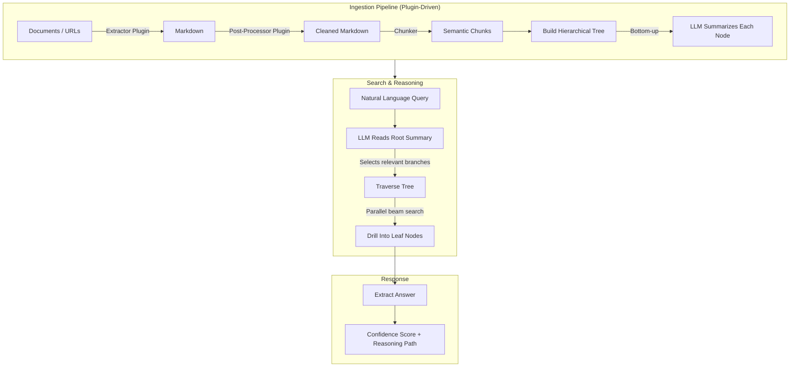

<p align="center">
  
</p>

<h1 align="center">ReasonDB</h1>

<p align="center">
  <strong>AI-Native Document Intelligence</strong>
</p>

<p align="center">
  The database that understands your documents. Built for AI agents that need to reason, not just retrieve.
</p>

<p align="center">
  <a href="https://docs.reasondb.dev">Documentation</a> •
  <a href="https://docs.reasondb.dev/quickstart">Quick Start</a> •
  <a href="https://docs.reasondb.dev/api-reference/introduction">API Reference</a>
</p>

---

**Your documents hold answers. ReasonDB finds them.**

While traditional databases treat documents as data to be indexed, ReasonDB treats them as knowledge to be understood. It's the first database designed from the ground up for how AI actually thinks—navigating hierarchical context, reasoning through complexity, and extracting precise answers from unstructured content.

> **ReasonDB is not another vector database.** It's a reasoning engine that preserves document structure, enabling AI to traverse your knowledge like a human expert would—scanning summaries, drilling into relevant sections, and synthesizing answers with full context.

## The Problem with Current Approaches

AI agents today are crippled by their databases:

| Approach | What It Does | Why It Fails |
|----------|--------------|--------------|
| **Vector DBs** | Finds "similar" chunks | Loses structure. A contract's termination clause isn't "similar" to your question about exit terms—but it's the answer. |
| **RAG Pipelines** | Retrieves then generates | Garbage in, garbage out. Retrieving wrong chunks means wrong answers, no matter how good your LLM. |
| **Knowledge Graphs** | Maps explicit relationships | Requires manual entity extraction. Can't handle the messy reality of real documents. |

**The result?** AI agents that hallucinate, miss critical context, or drown in irrelevant chunks.

## ReasonDB: Intelligence by Design

ReasonDB introduces **Hierarchical Reasoning Retrieval (HRR)**—a fundamentally new architecture where the LLM doesn't just consume retrieved content, it actively navigates your document structure to find exactly what it needs.

- **🌳 Structure-Aware**: Documents become navigable trees, preserving the hierarchy that makes complex documents understandable.
- **🧠 LLM-Guided Traversal**: AI reasons through summaries at each level, choosing which branches to explore—like an expert scanning a document.
- **⚡ Parallel Beam Search**: Explore multiple promising paths simultaneously. Find answers even when they're buried in unexpected places.

## See the Difference

<details>
<summary><strong>Vector DB Approach</strong></summary>

```
Query: "What are the termination conditions?"

→ Embed query as vector
→ Find 5 "similar" chunks
→ Hope one contains the answer

Result: Random paragraphs mentioning "termination" 
        scattered across the document. No context.
        LLM hallucinates missing details.
```
</details>

<details>
<summary><strong>ReasonDB Approach</strong></summary>

```
Query: "What are the termination conditions?"

→ LLM reads document summary
→ Identifies "Section 8: Termination" as relevant
→ Navigates to section, reads subsection summaries
→ Drills into "8.2 Conditions for Termination"
→ Extracts complete answer with full context

Result: Precise answer citing specific clauses,
        with confidence score and reasoning path.
```
</details>

## Quick Start

Get from zero to intelligent document search in under 5 minutes:

```bash
# Clone and build
git clone https://github.com/reasondb/reasondb.git && cd reasondb
cargo build --release

# Interactive setup wizard
reasondb config init

# Start the server
reasondb serve
```

Server starts at **http://localhost:4444** with Swagger UI at **http://localhost:4444/swagger-ui/**

### Docker (Local Testing)

```bash
# Build the image and start the container
docker compose up --build

# Run in detached (background) mode
docker compose up --build -d

# View logs when running detached
docker compose logs -f

# Stop the running containers
docker compose down

# Stop and remove the persisted data volume
docker compose down -v

# Rebuild from scratch (no cache)
docker compose build --no-cache

# Check container health status
docker compose ps
```

Configure the LLM provider via environment variables or a `.env` file in the project root:

| Variable | Description | Required |
|---|---|---|
| `REASONDB_LLM_PROVIDER` | `openai`, `anthropic`, `gemini`, or `cohere` | Yes |
| `REASONDB_LLM_API_KEY` | API key for the chosen provider | Yes |
| `REASONDB_MODEL` | Override the default model for the provider | No |

```bash
# Option 1: export before running
REASONDB_LLM_PROVIDER=openai REASONDB_LLM_API_KEY=sk-... docker compose up --build

# Option 2: create a .env file (git-ignored)
cat > .env <<'EOF'
REASONDB_LLM_PROVIDER=anthropic
REASONDB_LLM_API_KEY=sk-ant-...
EOF
docker compose up --build
```

### Query with RQL

ReasonDB uses **RQL** — a SQL-like query language with built-in `SEARCH` and `REASON` clauses:

```sql
-- Fast keyword search (BM25, ~50ms)
SELECT * FROM contracts SEARCH 'payment terms' LIMIT 5

-- LLM-guided reasoning (navigates the document tree)
SELECT * FROM contracts REASON 'What are the late fees and penalties?'

-- Combine filters, search, and reasoning in one query
SELECT * FROM contracts
WHERE tags CONTAINS 'nda' AND metadata.value_usd > 10000
SEARCH 'termination clause'
REASON 'What are the exit conditions?'
LIMIT 5
```

## How It Works



1. **Extract** — Extractor plugins convert documents and URLs to Markdown (built-in: [MarkItDown](https://github.com/microsoft/markitdown))
2. **Chunk** — Content is split into semantic chunks with heading detection
3. **Build Tree** — Chunks are organized into a hierarchical tree structure
4. **Summarize** — LLM generates summaries for each node (bottom-up)
5. **Search** — LLM traverses the tree, choosing branches based on summaries via parallel beam search
6. **Return** — Relevant content with extracted answers, confidence scores, and the full reasoning path

## Plugin Architecture

ReasonDB uses a **plugin system** for all document extraction. Plugins are external processes (Python, Node.js, Bash, or compiled binaries) that communicate via JSON over stdin/stdout.

| What ships out of the box | What you can add |
|---------------------------|------------------|
| **markitdown** — PDF, Word, Excel, PowerPoint, HTML, images (OCR), audio, YouTube, and more | Custom extractors, post-processors, chunkers, summarizers |

```bash
# List installed plugins
curl http://localhost:4444/v1/plugins

# Test a plugin
curl -X POST http://localhost:4444/v1/plugins/markitdown/test \
  -H "Content-Type: application/json" \
  -d '{"operation":"extract","params":{"source_type":"file","path":"/tmp/doc.pdf"}}'
```

Community plugins can be installed by dropping a directory into `$REASONDB_PLUGINS_DIR` (default: `./plugins`). See the [Plugin Guide](https://docs.reasondb.dev/guides/plugins) for details.

## Built for Production

| Feature | Description |
|---------|-------------|
| **Plugin Extraction** | Extensible document ingestion — PDF, Office, images, audio, URLs out of the box |
| **RQL Query Language** | SQL-like syntax with `SEARCH` (BM25) and `REASON` (LLM) clauses |
| **Multi-Provider LLM** | Anthropic, OpenAI, Gemini, Cohere — switch without code changes |
| **API Key Auth** | Production-ready security with fine-grained permissions |
| **Rate Limiting** | Built-in protection with configurable limits |
| **High Performance** | Rust-powered, ACID-compliant, async parallel traversal |

## Use Cases

- **📜 Legal Document Analysis**: Navigate complex contracts, find specific clauses, compare terms across agreements
- **🎓 Research & Knowledge Management**: Build searchable knowledge bases from papers, reports, and documentation
- **🎧 Customer Support Intelligence**: Transform support docs into an AI agent that finds precise answers
- **🛡️ Compliance & Policy**: Query policy documents in natural language with section references

## Tech Stack

- **Storage**: `redb` — Pure Rust, ACID-compliant embedded database
- **Search**: `tantivy` — Blazing fast BM25 full-text search
- **Extraction**: Plugin system — Process-based plugins (Python, Node.js, Bash, binaries)
- **Async Runtime**: `tokio` — Parallel branch exploration
- **HTTP Server**: `axum` — Fast, ergonomic web framework
- **LLM Integration**: `rig-core` — Multi-provider LLM abstraction
- **API Docs**: `utoipa` — OpenAPI 3.0 + Swagger UI
- **Docker**: Alpine-based image with Python 3, Node.js, and Bash runtimes

## Documentation

- **[Full Documentation](https://docs.reasondb.dev)** — Complete guides and tutorials
- **[Quick Start](https://docs.reasondb.dev/quickstart)** — Get running in 5 minutes
- **[Core Concepts](https://docs.reasondb.dev/concepts)** — Understand trees, nodes, and HRR
- **[Plugin Guide](https://docs.reasondb.dev/guides/plugins)** — Build custom extraction and processing plugins
- **[API Reference](https://docs.reasondb.dev/api-reference/introduction)** — Complete REST API documentation
- **[Swagger UI](http://localhost:4444/swagger-ui/)** — Interactive API docs (when server is running)

## License

ReasonDB is source-available under the [ReasonDB License v1.0](./LICENSE).

**You can:**
- ✅ Use ReasonDB for any purpose (commercial or non-commercial)
- ✅ Modify the source code
- ✅ Distribute copies and derivative works
- ✅ Use in your own products and services

**You cannot:**
- ❌ Offer ReasonDB as a hosted/managed database service (DBaaS)
- ❌ Provide ReasonDB's functionality as a service to third parties

For commercial licensing to offer ReasonDB as a service, please contact us.

---

<p align="center">
  <strong>Star us on GitHub</strong> if ReasonDB helps your AI agents think better! ⭐
</p>
