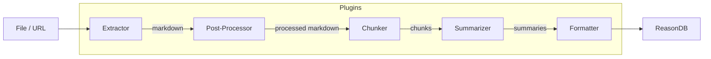

ReasonDB uses a **plugin architecture** for document ingestion. Every pipeline stage — from extracting PDFs to summarizing content — is handled by plugins that communicate via JSON over stdin/stdout.

The built-in `markitdown` plugin ships out of the box and covers most formats. You can override any stage with your own plugin or install community plugins.

## Architecture



Each plugin is an **external process** that:

1. Lives in its own directory under `$REASONDB_PLUGINS_DIR`
2. Declares capabilities in a `plugin.toml` manifest
3. Reads a JSON request from **stdin**
4. Writes a JSON response to **stdout**
5. Exits after handling one request (one-shot model)

## Supported Runtimes

Plugins must use one of these runtimes. Other interpreters are rejected at load time to keep the Docker image lean.

| Runtime | `command` value | Notes |
|---------|----------------|-------|
| Python | `python3` or `python` | Included in Docker image |
| Node.js | `node` | Included in Docker image |
| Bash | `bash` or `sh` | Included in Docker image |
| Compiled binary | `./my-binary` or `/abs/path` | Build with Rust, Go, C, etc. and ship the binary |

## Plugin Types

| Type | Operation | Description |
|------|-----------|-------------|
| `extractor` | `extract` | Convert files or URLs to markdown |
| `post_processor` | `process` | Transform markdown before chunking |
| `chunker` | `chunk` | Split markdown into chunks |
| `summarizer` | `summarize` | Generate summaries for content |
| `formatter` | `format` | Format output nodes |

## Built-in Plugin: MarkItDown

ReasonDB ships with the `markitdown` plugin which wraps [Microsoft MarkItDown](https://github.com/microsoft/markitdown). It handles:

- **Documents**: PDF, Word (.docx), PowerPoint (.pptx), Excel (.xlsx)
- **Web**: HTML pages, URLs, YouTube videos
- **Text**: Plain text, Markdown, CSV, JSON, XML
- **Media**: Images (OCR), Audio (transcription)
- **Archives**: ZIP, EPUB, Outlook (.msg/.eml)

No configuration needed — it's auto-discovered on startup.

## Protocol

### Request (stdin)

```json
{
  "version": 1,
  "operation": "extract",
  "params": {
    "source_type": "file",
    "path": "/tmp/document.pdf",
    "config": {}
  }
}
```

### Success Response (stdout)

```json
{
  "version": 1,
  "status": "ok",
  "result": {
    "title": "My Document",
    "markdown": "# Content...",
    "metadata": {}
  }
}
```

### Error Response (stdout)

```json
{
  "version": 1,
  "status": "error",
  "error": "Description of what went wrong"
}
```

## Manifest Format

Every plugin needs a `plugin.toml` in its directory:

```toml
[plugin]
name = "my-plugin"
version = "1.0.0"
description = "What this plugin does"
author = "Your Name"
license = "MIT"

[plugin.runner]
command = "python3"          # runtime to use
args = ["my_script.py"]     # arguments passed to command
timeout_secs = 60           # max execution time (default: 120)

[plugin.capabilities]
kind = "extractor"           # plugin type (see table above)
formats = ["pdf", "docx"]   # file formats handled (extractor only)
handles_urls = true          # can handle URLs? (extractor only)
url_patterns = ["*"]         # URL patterns to match (extractor only)
priority = 100               # higher number = tried first
```

### Priority

When multiple plugins handle the same format, the one with the **higher priority** wins. If it fails, the next plugin is tried. The built-in `markitdown` plugin has priority `200`.

## Writing a Plugin

<Steps>
  <Step title="Create a directory">
    ```bash
    mkdir -p plugins/my-extractor
    ```
  </Step>
  <Step title="Add a plugin.toml manifest">
    ```toml title="plugins/my-extractor/plugin.toml"
    [plugin]
    name = "my-extractor"
    version = "1.0.0"
    description = "My custom extractor"
    author = "Me"
    license = "MIT"

    [plugin.runner]
    command = "python3"
    args = ["extract.py"]

    [plugin.capabilities]
    kind = "extractor"
    formats = ["custom-format"]
    priority = 300
    ```
  </Step>
  <Step title="Implement the script">
    Your script reads JSON from stdin and writes JSON to stdout:

    ```python title="plugins/my-extractor/extract.py"
    import json, sys, os

    def main():
        request = json.loads(sys.stdin.read())

        if request.get("operation") != "extract":
            json.dump({"version": 1, "status": "error",
                        "error": "Only extract is supported"}, sys.stdout)
            return

        path = request.get("params", {}).get("path", "")
        if not path or not os.path.isfile(path):
            json.dump({"version": 1, "status": "error",
                        "error": f"File not found: {path}"}, sys.stdout)
            return

        with open(path, "r") as f:
            content = f.read()

        title = os.path.splitext(os.path.basename(path))[0]
        json.dump({
            "version": 1,
            "status": "ok",
            "result": {
                "title": title,
                "markdown": content,
                "metadata": {},
            },
        }, sys.stdout)

    if __name__ == "__main__":
        main()
    ```
  </Step>
  <Step title="Test it">
    ```bash
    echo '{"version":1,"operation":"extract","params":{"source_type":"file","path":"README.md"}}' \
      | python3 plugins/my-extractor/extract.py
    ```
  </Step>
  <Step title="Restart ReasonDB">
    Plugins are discovered on startup. Restart the server and check the logs:

    ```
    INFO reasondb_server: Discovered 2 plugins
    ```

    Or query the API:

    ```bash
    curl http://localhost:4444/v1/plugins
    ```
  </Step>
</Steps>

## Example: Node.js Post-Processor

A post-processor receives extracted markdown and transforms it before chunking.

```javascript title="plugins/my-processor/process.js"
let input = "";
process.stdin.setEncoding("utf8");
process.stdin.on("data", (chunk) => (input += chunk));
process.stdin.on("end", () => {
  try {
    const request = JSON.parse(input);
    const { markdown = "" } = request.params || {};

    // Strip HTML comments, normalize whitespace
    let processed = markdown.replace(/<!--[\s\S]*?-->/g, "");
    processed = processed.replace(/\n{3,}/g, "\n\n");

    process.stdout.write(JSON.stringify({
      version: 1,
      status: "ok",
      result: { markdown: processed, metadata: {} },
    }));
  } catch (err) {
    process.stdout.write(JSON.stringify({
      version: 1, status: "error", error: err.message,
    }));
  }
});
```

```toml title="plugins/my-processor/plugin.toml"
[plugin]
name = "my-processor"
version = "1.0.0"
description = "Clean up markdown before chunking"
author = "Me"
license = "MIT"

[plugin.runner]
command = "node"
args = ["process.js"]

[plugin.capabilities]
kind = "post_processor"
priority = 100
```

## Installation

Copy a plugin directory into the plugins folder:

```bash
cp -r my-plugin/ ./plugins/

# Or set a custom location
export REASONDB_PLUGINS_DIR=/path/to/plugins
```

In Docker, plugins in `./plugins/` are automatically mounted and hot-reloaded during development via `docker compose watch`.

## Configuration

| Variable | Default | Description |
|---|---|---|
| `REASONDB_PLUGINS_DIR` | `./plugins` | Directory to scan for plugins |
| `REASONDB_PLUGINS_ENABLED` | `true` | Enable/disable plugin system |
| `REASONDB_PLUGIN_TIMEOUT` | `120` | Default timeout in seconds |

## API Endpoints

| Method | Path | Description |
|---|---|---|
| `GET` | `/v1/plugins` | List all discovered plugins |
| `GET` | `/v1/plugins/:name` | Get details for a specific plugin |
| `POST` | `/v1/plugins/:name/test` | Test a plugin with arbitrary input |
